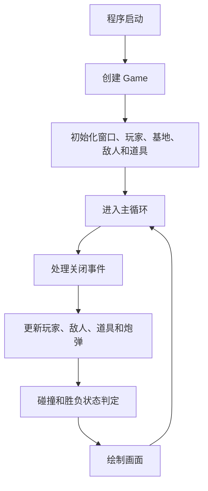
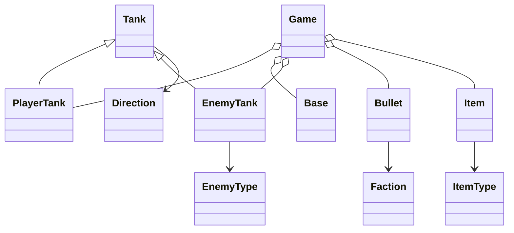

# 总体设计

## 1. 系统架构

| 组件 | 设计职责 | 当前状态 |
| -- | -- | -- |
| Game | 程序入口、窗口、主循环、实体容器和基础状态判定 | 已存在 |
| World | 一局游戏的世界管理 | 计划新增 |
| Map | 地图数据和绘制 | 文件存在但为空 |
| Entity | 基础枚举和全局原型参数 | 已存在 |
| Tank | 坦克公共属性、受伤、治疗、射击、绘制辅助 | 已存在 |
| PlayerTank | 玩家输入、移动、射击、拾取道具 | 已存在 |
| EnemyTank | 敌人属性、固定移动、自动射击 | 已存在 |
| Bullet | 炮弹移动、阵营、伤害和拥有者记录 | 已存在 |
| Item | 血包和弹药强化包 | 已存在 |
| Base | 基地生命、受击和绘制 | 已存在 |
| AIController | 敌人决策 | 计划新增 |
| MapEditor | 地图编辑 | 计划新增 |
| NetworkSession | 联机通信 | 计划新增 |
| UI | 菜单和 HUD | 计划新增 |

## 2. 分层结构

- 表现层：当前由 SFML 窗口和几何图形绘制承担。
- 游戏逻辑层：当前集中在 `Game` 中。
- 实体层：`Tank`、`PlayerTank`、`EnemyTank`、`Bullet`、`Item`、`Base`。
- 地图层：文件存在但未实现。
- AI 层：当前只有敌人固定方向和自动射击，独立 AI 层待实现。
- 网络层：待实现。
- 资源层：文件存在但未实现。
- 配置层：`config/game_config.ini` 存在但为空，配置读取待实现。

## 3. 核心运行流程

## 4. 类关系

当前结构：

计划结构：后续可增加 `World`、`Map`、`AIController`、`MapEditor`、`NetworkSession` 和 `UI`，但这些不是当前已实现关系。

## 5. 游戏状态设计

当前已存在：`Running`、`Victory`、`Defeat`。

计划保留状态：`MainMenu`、`Playing`、`Paused`、`Victory`、`Defeat`、`MapEditor`、`HostGame`、`JoinGame`。当前没有完整状态机，待实现。

## 6. 数据流

当前数据流为输入更新玩家，敌人按固定方向和自动射击更新，炮弹集合统一在 `Game` 中碰撞判定，命中后修改实体生命并删除炮弹。

## 7. 资源管理

当前没有实际资源加载逻辑。`resource_manager` 文件为空，`assets/` 目录存在但没有从代码中确认使用资源。

## 8. 异常和错误处理

当前主要依赖基础边界判断和生命值限制，尚未建立资源加载失败、配置读取失败或网络异常处理。

## 9. 后续扩展设计

建议先把 `Game` 中的世界状态迁移到 `World`，再补地图层和 AI 层，最后接入 UI、联机和资源系统。
