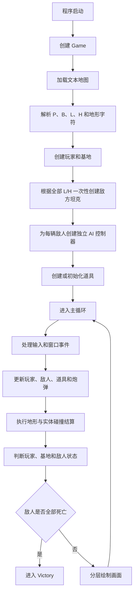
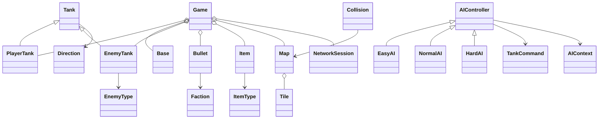

# 总体设计

## 1. 系统架构

| 组件 | 设计职责 | 当前状态 |
| -- | -- | -- |
| Game | 程序入口、窗口、主循环、地图加载、实体容器、碰撞结算和基础状态判定 | 已存在 |
| World | 一局游戏的世界管理 | 计划新增 |
| Map | 地图数据、文本加载、玩家和基地位置记录、轻型与重型敌人初始部署记录、瓦片查询和分层绘制接口 | 已存在，待适配 `L/H` 标记 |
| Entity | 基础枚举和全局原型参数 | 已存在 |
| Tank | 坦克公共属性、受伤、治疗、射击、绘制辅助 | 已存在 |
| PlayerTank | 玩家输入、移动、射击、拾取道具 | 已存在 |
| EnemyTank | 敌人属性、移动和射击执行接口 | 已存在 |
| Bullet | 炮弹移动、阵营、伤害和拥有者记录 | 已存在 |
| Item | 血包和弹药强化包 | 已存在 |
| Base | 基地生命、受击和绘制 | 已存在 |
| AIController | 敌人决策抽象接口 | 已存在 |
| EasyAI / NormalAI / HardAI | 敌方 AI 策略类 | EasyAI、NormalAI 和 HardAI 均已有初步实现 |
| MapEditor | 地图编辑 | 暂不实现 |
| NetworkSession | 联机通信、主机监听、客户端连接和消息收发 | 已存在，未实机测试 |
| UI | HUD、暂停菜单、设置界面和状态提示 | 计划新增 |

## 2. 分层结构

- 表现层：当前由 SFML 窗口和几何图形绘制承担；后续计划新增 `ui/` 模块承接 HUD、暂停菜单和设置界面。
- 游戏逻辑层：当前集中在 `Game` 中。
- 实体层：`Tank`、`PlayerTank`、`EnemyTank`、`Bullet`、`Item`、`Base`。
- 地图层：`Tile`、`Map` 和 `Collision` 负责文本地图加载、瓦片查询、实体初始位置记录、分层绘制、地形碰撞和砖墙破坏。地图中的 `L` 和 `H` 分别记录轻型和重型敌方坦克的初始部署，解析完成后对应格子作为空地处理。
- AI 层：已建立 `AIController`、`AIContext`、`TankCommand` 和三类敌方 AI 类型；`EasyAI`、`NormalAI` 和 `HardAI` 已有初步 `.cpp` 实现，当前游戏测试流程接入 `HardAI`。
- 网络层：已建立网络消息、网络会话和主机权威快照同步代码雏形，双端实机测试待完成。
- 资源层：文件存在但未实现。
- 配置层：`config/game_config.ini` 存在但为空，配置读取待实现。

## 3. 核心运行流程

## 4. 类关系

当前结构：

计划结构：后续可增加 `World` 和 `UI`，并继续完善已经建立的 `AIController` 与 `NetworkSession`。其中 `UI` 计划先实现 HUD，用于显示玩家血量、剩余敌人数和弹药强化状态。`MapEditor` 暂不实现。

## 5. 游戏状态设计

当前已存在：`Running`、`Victory`、`Defeat`。

计划保留状态：`MainMenu`、`Playing`、`Paused`、`Victory`、`Defeat`、`HostGame`、`JoinGame`。当前没有完整状态机，待实现。`MapEditor` 状态不再纳入当前范围。

## 6. 数据流

地图加载阶段首先读取文本字符。`Map` 将 `P` 记录为玩家初始位置，将 `B` 记录为基地位置，并将每个 `L` 和 `H` 转换为带有位置和敌人类型的初始化数据。上述标记对应的底层瓦片统一按空地处理。

`Game` 根据地图数据创建玩家、基地和全部敌方坦克。所有敌人在进入主循环前一次性创建，不存在运行过程中的波次补充或定时生成。

运行阶段由输入更新玩家，`Game` 构造 `AIContext` 后调用敌方 AI 生成 `TankCommand`，再由敌人执行移动、转向和射击。炮弹集合由 `Game` 统一进行碰撞判定，命中后修改实体生命、破坏砖墙或删除炮弹。

敌人死亡后从敌人容器中移除，不再重新创建。当敌人容器为空时进入胜利状态。

网络模式采用主机权威流程：客户端发送输入，主机更新完整游戏世界并发送快照，客户端应用快照。敌人的类型、位置和状态应由主机同步给客户端。

## 7. 资源管理

当前没有实际资源加载逻辑。`resource_manager` 文件为空，`assets/` 目录存在但没有从代码中确认使用资源。

## 8. 异常和错误处理

当前主要依赖基础边界判断和生命值限制。网络会话已包含基础连接失败状态和断开接口，但尚未建立完整网络异常恢复、重连、超时处理和同步校验。

## 9. 后续扩展设计

建议先把 `Game` 中的世界状态迁移到 `World`，并新增 `ui/` 模块实现 HUD。后续暂停菜单、设置界面和状态提示继续放在 UI 层扩展，不放入地图或实体模块。
